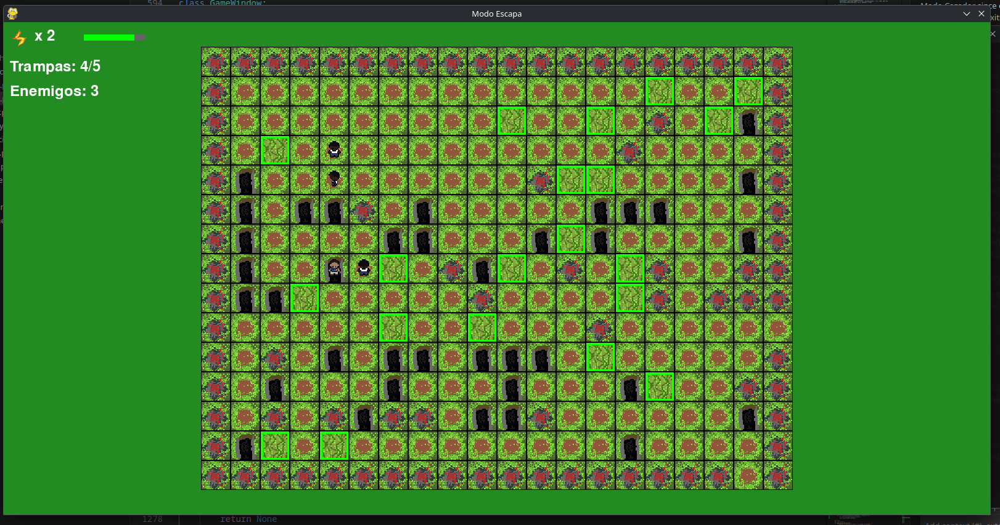

## Maze Escape Project



---

### Project Summary

This project is a **maze game** developed in **Python** using the **Pygame** library, implemented for the "Introduction to Programming" course.

The system offers two distinct game modes:

* **Escape Mode (Modo Escapa):** The player must flee from the hunters and reach the exit. The score is based on the escape time and the level's difficulty
* **Hunter Mode (Modo Cazador):** The roles are inverted; the player must chase and capture the enemy hunters before they reach the exits. Points are gained by capturing them and lost if they escape.

---

### Documentation

Click below to access the required documentation:

[View Project Documentation](docs/documentacion.pdf)

---

### Installation and Execution

#### 1. Installation

If you don't have Pygame installed, run the following command to install it.

```bash
pip install -r requirements.txt
```

#### 2. Execution

Once its installed, you can start the game by running the main Python file:

```bash
python main.py
```
